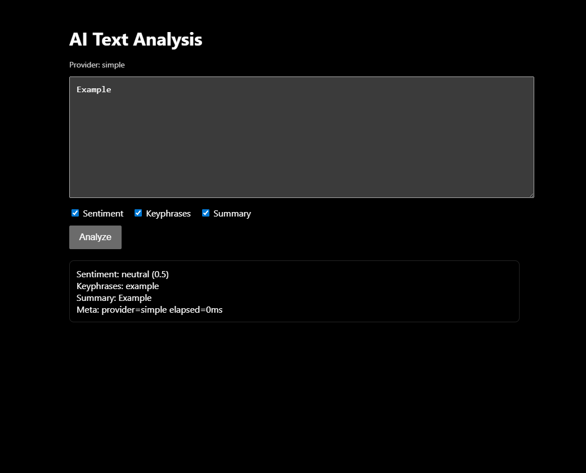
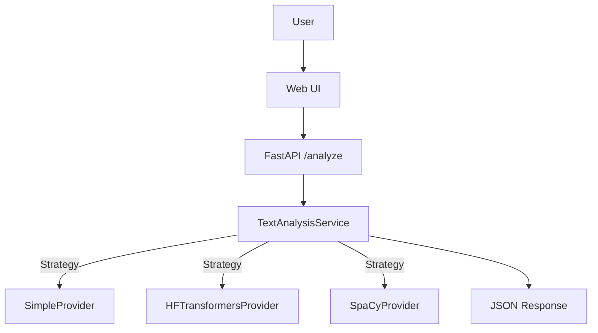

# AI-Powered Text Analysis API

A FastAPI backend with a minimal web UI that analyzes user text and returns sentiment, keyphrases, and a brief summary. Pluggable NLP providers support simple heuristics, Hugging Face Transformers, and spaCy.

## Screenshot

## Features
- Async REST API `POST /analyze` and `GET /health`
- Concurrent sentiment, keyphrase extraction, and summary
- Strategy-based NLP providers: `simple`, `hf`, `spacy`
- Minimal frontend served from `public/`
- Environment-driven configuration

## Architecture

## Quickstart
- Install base dependencies:
  - `python -m pip install -r requirements.txt`
- Run the server:
  - `python -m uvicorn app.main:app --host 127.0.0.1 --port 8000`
- Open the web UI:
  - `http://127.0.0.1:8000/`
- API docs:
  - `http://127.0.0.1:8000/docs`

## Configuration
- `PROVIDER`: `simple` (default), `hf`, or `spacy`
- `MAX_CHARS`: maximum input length (default `10000`)
- `SENTIMENT_MODEL`: HF sentiment model (default `distilbert-base-uncased-finetuned-sst-2-english`)
- `SUMMARIZER_MODEL`: HF summarizer model (default `facebook/bart-large-cnn`)
- `SPACY_MODEL`: spaCy model (default `en_core_web_sm`)

Set as environment variables before starting the app.

## Optional Dependencies
- For `PROVIDER=hf`:
  - `pip install transformers torch --upgrade`
- For `PROVIDER=spacy`:
  - `pip install spacy` and `python -m spacy download en_core_web_sm`

These are optional; the default `simple` provider requires no extra models.

## API
- Request `POST /analyze`
  - `{"text":"...","options":{"sentiment":true,"keyphrases":true,"summary":true}}`
- Response
  - `{ "sentiment": { "label": "positive|negative|neutral", "score": number }, "keyphrases": [string], "summary": string, "meta": { "provider": string, "elapsed_ms": number } }`

## Frontend
- `public/index.html`, `public/app.js`, `public/style.css`
- Calls `/health` to show provider and `/analyze` to display results

## Notes
- If spaCy or Transformers are not installed, provider methods raise descriptive errors; use `PROVIDER=simple` or install optional dependencies.
- OpenAI integration is planned as an additional provider.

## Security
- Put secrets only in environment variables (`OPENAI_API_KEY`, etc.) and never hardcode them.
- `.gitignore` excludes `.env`, `.env.*`, `*.env`, key/cert files (`*.key`, `*.pem`, `*.crt`, `*.pfx`, `*.cer`) and common secret folders like `.secrets/`.
- Avoid logging raw text payloads or secrets; log sizes and request IDs instead.
- Do not store user texts persistently unless explicitly required and compliant with your privacy policy.

## Push To GitHub
- Initialize and push:
  - `git init`
  - `git add .`
  - `git commit -m "feat: AI text analysis API with frontend"`
  - `git branch -M main`
  - `git remote add origin https://github.com/<your-user>/<your-repo>.git`
  - `git push -u origin main`
- GitHub renders Mermaid diagrams in README by default.